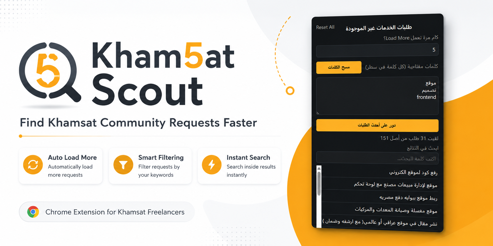

# Kham5at Scout 🔎

> A Chrome Extension that makes browsing Khamsat community requests faster with automatic loading, keyword filtering, and smart search.

<p align="center">
  
</p>

---


## ✨ Overview

Kham5at Scout is a lightweight Chrome Extension designed to improve the experience of browsing the **Khamsat Community Requests** page.

Since Khamsat doesn't provide built-in filtering or searching for community requests, Kham5at Scout helps freelancers quickly find opportunities matching their skills without manually scrolling through dozens of posts.

---

## 🎬 Demo

<p align="center">
  
</p>

---

## 🚀 Features

| Feature               | Description                                                                        |
| --------------------- | ---------------------------------------------------------------------------------- |
| 🔄 Auto Load More     | Automatically clicks **"Load Older Topics"** multiple times to load more requests. |
| 🔍 Keyword Filtering  | Filter requests using your own keywords (React, Frontend, Next.js, UI, etc.).      |
| ⚡ Live Search        | Instantly search inside filtered results without running another scan.             |
| 💾 Persistent Results | Results remain available after reopening the popup until a new search is started.  |
| 🧹 Quick Reset        | Clear keywords only or completely reset saved settings and results.                |
| 🎯 Lightweight        | Built with pure JavaScript (no external libraries).                                |

---

## 📷 Screenshots

| Initial Search                            | Searching                                 | Results                                   |
| ----------------------------------------- | ----------------------------------------- | ----------------------------------------- |
|  |  |  |

---

## 📦 Installation

### Chrome / Microsoft Edge

1. Clone the repository

```bash
git clone https://github.com/Abdul-Rahman-Rafat/kham5at-scout.git
```

2. Open

```
chrome://extensions
```

or

```
edge://extensions
```

3. Enable **Developer Mode**

4. Click **Load unpacked**

5. Select the project folder

6. The extension icon will appear in your browser toolbar.

---

## 🛠 Usage

1. Visit

https://khamsat.com/community/requests

2. Click the **Kham5at Scout** icon.

3. Select how many times to load older requests.

4. Enter your keywords (one keyword per line).

Example:

```
React
Frontend
Next.js
Tailwind
TypeScript
```

5. Click **Search Requests**.

6. Browse only matching requests.

---

## 🏗 Project Structure

```
kham5at-scout/
│
├── icons/
│
├── manifest.json
├── content.js
├── popup.html
├── popup.css
├── popup.js
│
├── assets/
│   ├── banner.png
│   ├── demo.gif
│   └── screenshots/
│
└── README.md
```

---

## ⚙ Tech Stack

- Chrome Extension Manifest V3
- HTML5
- CSS3
- Vanilla JavaScript
- Chrome Storage API

---

## ⚠ Known Limitations

- Works only on:

```
https://khamsat.com/community/requests
```

- The extension relies on the **"عرض المواضيع الأقدم"** button.

If Khamsat changes its HTML structure or button text, a small update may be required.

---

## 🤝 Contributing

Pull requests are welcome.

For major changes, please open an issue first to discuss what you'd like to change.

---

## ⚠ Disclaimer

Kham5at Scout is an independent browser extension.

It is **not affiliated with, endorsed by, or officially connected to Khamsat**.

---

## 📄 License

This project is licensed under the MIT License.
